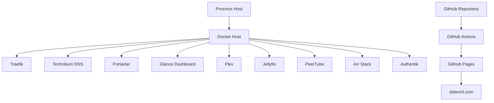

---
hide:
  - navigation
  - toc
---

# Homelab Architecture

This page shows a full view of the homelab service layout.

```mermaid
flowchart TD
    A[Proxmox Host]

    A --> B[Docker Host]
    B --> C[Traefik]
    B --> D[Technitium DNS]
    B --> E[Portainer]
    B --> F[Glance Dashboard]
    B --> G[Plex]
    B --> H[Jellyfin]
    B --> I[PeerTube]
    B --> J[Arr Stack]
    B --> K[Authentik]

    L[GitHub Repository] --> M[GitHub Actions]
    M --> N[GitHub Pages]
    N --> O[dstencil.com]
```