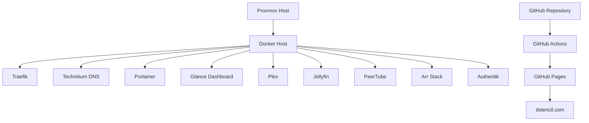
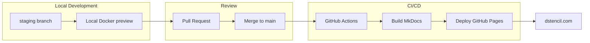

# Homelab

My homelab is where I experiment with infrastructure design, containerized services, networking, and automation.

It functions as a personal platform for testing deployment patterns and operational workflows.

## Core Infrastructure

- **Virtualization:** Proxmox
- **Container Runtime:** Docker / Docker Compose
- **Reverse Proxy:** Traefik
- **DNS:** Technitium
- **CI/CD:** GitHub Actions
- **Hosting:** GitHub Pages for public content

## Architecture Overview

[View full architecture diagram →](/homelab/architecture/)

## Development Workflow

Infrastructure and documentation follow a Git-based workflow designed to safely test changes before publishing updates.

[View full Development Workflow →](/homelab/workflow/)

## Goals

The homelab allows me to:

- test infrastructure designs
- experiment with service deployment patterns
- document reproducible setups
- build practical DevOps and systems administration experience

## Focus Areas

My current focus includes:

- Linux systems administration
- Docker-based application deployment
- reverse proxy and TLS design
- DNS and internal service resolution
- documentation-driven infrastructure
- safe change workflows using Git branches and pull requests