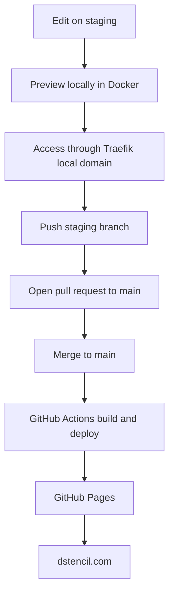

# Site Deployment Workflow

This site is built and published using a staged workflow that separates local development from public deployment.

## Deployment Flow

## Local Development

The site is developed locally inside a Docker container using MkDocs Material.

The container is reverse proxied internally through Traefik, which allows the site to be previewed on a local domain before publication.

## Branching Strategy

The repository uses two primary branches:

- `staging` for local development and preview
- `main` for public production deployment

Changes are made on `staging`, reviewed in the local preview environment, and then merged into `main` when ready.

## Public Deployment

When changes are merged into `main`, GitHub Actions builds the MkDocs site and deploys it to GitHub Pages.

The public domain is pointed at GitHub Pages, which serves the site over HTTPS.

## Why This Workflow

This workflow allows me to:

- validate content locally before publishing
- separate working changes from production
- use pull requests as a controlled promotion path
- maintain a simple CI/CD-style publishing process