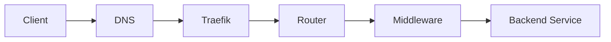

# Traefik Deployment Runbook

This runbook documents a reproducible Traefik deployment pattern for a Docker-based homelab or small self-hosted environment.

Follow this guide exactly. Only modify:

- your domain name
- your backend service names
- your Docker network name
- your certificate resolver (if not using Cloudflare)

---

## Purpose

Traefik is the reverse proxy and TLS termination layer.

Responsibilities:

- route traffic by hostname
- terminate TLS
- apply shared middleware
- prevent direct exposure of backend services

---

## Architecture



---

## Folder Structure

```text
traefik/
├── compose.yaml
├── traefik.yaml
├── .env
├── .env.dec
├── acme.json
├── logs/
├── dynamic/
│   ├── apps/
│   │   └── example.yaml
│   ├── 00-global-middlewares.yaml
│   ├── 01-tls-options.yaml
│   ├── 02-dashboard.yaml
│   └── 03-servers-transports.yaml
```

---

## Step 1 — Create `.env`

```env
# Created: <Creation Date> | Expires: <EXPIRE Date>
CF_DNS_API_TOKEN=your_cloudflare_token
```

### Step 1.2 - Encrypt `.env`

```zsh
sops -e --in-place .env
```

### Step 1.3 - Decrypt `.env` to `.env.dec`

```zsh
sops -d .env > .env.dec
```

!!! note
    Ensure that you have `.env.dec` set in your `.gitignore` to prevent secrets from being pushed to git.

Environment-specific values such as credentials and domain information should be stored encrypted in `.env` and decrypted to `.env.dec` before deployment.

---

## Step 2 — Create `compose.yaml`

```yaml
---
services:
  traefik:
    image: docker.io/library/traefik:v3.6.2
    container_name: traefik
    networks:
      traefik:
        ipv4_address: 172.30.0.2
      default:
        ipv4_address: 192.168.1.2  # Static IP address for Traefik on macvlan
    security_opt:
      - no-new-privileges:true
    ports:
      - 80:80
      - 443:443
      - 127.0.0.1:8080:8080
    env_file:
      - .env.dec
    volumes:
      - /etc/localtime:/etc/localtime:ro
      - /var/run/docker.sock:/var/run/docker.sock:ro
      - ./traefik.yaml:/traefik.yaml:ro
      - ./acme.json:/acme.json
      - ./dynamic:/dynamic:ro
      - ./logs/access.log:/var/log/traefik/access.log
      - ./logs/traefik.log:/var/log/traefik/traefik.log
    restart: always

networks:
  traefik:
    name: traefik
    driver: bridge
    ipam:
      config:
        - subnet: 172.30.0.0/24
          gateway: 172.30.0.1
          ip_range: 172.30.0.128/25 # <-- dynamic IPs ONLY from .128-.254
    
  default:
    external: true
    name: default-net
```

This example reflects the general deployment pattern used in the homelab.

!!! note
    The compose example above uses a macvlan network (`default-net`) so the
    container receives an IP on the local network.

    This network must be created on the Docker host before deploying the stack.

    If the Docker host can bind ports 80 and 443 directly, published ports
    can be used instead of macvlan.

!!! note
    This example shows both:
    - a dedicated bridge network for backend container communication
    - a macvlan network for LAN presence

    It also publishes ports 80 and 443.

    Do not change this pattern unless you understand why your environment needs a different ingress design.

---

## Step 3 — Create `traefik.yaml` (Static Config)

```yaml
global:
  checkNewVersion: false
  sendAnonymousUsage: false

# log levels: DEBUG, INFO, WARN, ERROR
# formats: common, json, logfmt
log:
  level: ERROR
  format: common
  filePath: /var/log/traefik/traefik.log

accessLog:
  format: common
  filePath: /var/log/traefik/access.log

api:
  dashboard: true
  insecure: false
  debug: false

entryPoints:
  web:
    address: ":80"
    http:
      redirections:
        entryPoint:
          to: websecure
          scheme: https

  websecure:
    address: ":443"

providers:
  docker:
    endpoint: "unix:///var/run/docker.sock"
    exposedByDefault: false

  file:
    directory: /dynamic
    watch: true

certificatesResolvers:
  staging:
    acme:
      email: you@example.com
      storage: /acme.json
      caServer: "https://acme-staging-v02.api.letsencrypt.org/directory"
      dnsChallenge:
        provider: cloudflare
        resolvers:
          - "1.1.1.1:53"
          - "1.0.0.1:53"

  cloudflare:
    acme:
      email: you@example.com
      storage: /acme.json
      caServer: "https://acme-v02.api.letsencrypt.org/directory"
      dnsChallenge:
        provider: cloudflare
        resolvers:
          - "1.1.1.1:53"
          - "1.0.0.1:53"
```

---

## Step 4 — Create Global Middleware

`dynamic/00-global-middlewares.yaml`

```yaml
http:
  middlewares:
    default-headers:
      headers:
        frameDeny: true
        browserXssFilter: true
        contentTypeNosniff: true
        forceSTSHeader: true
        stsIncludeSubdomains: true
        stsPreload: true
        stsSeconds: 15552000
        customFrameOptionsValue: "SAMEORIGIN"
        customRequestHeaders:
          X-Forwarded-Proto: "https"

    default-allowlist:
      ipAllowList:
        sourceRange:
          - "10.0.0.0/8"
          - "192.168.0.0/16"
          - "172.16.0.0/12"

    gzip:
      compress: {}

    secured:
      chain:
        middlewares:
          - default-allowlist
          - default-headers
          - gzip

    # ---- Optional: only if you still use this anywhere ----
    https-redirectscheme:
      redirectScheme:
        scheme: https
        permanent: true
    
    # OPTIONAL IF WEBSOCKET NEED EXTRA HELP
    forwarded-proto-https:
      headers:
        customRequestHeaders:
          X-Forwarded-Proto: "https"
```

!!! warning
    The `secured` middleware includes an IP allowlist for private address space.
    Any service using this middleware will only be accessible from internal networks unless the allowlist is modified or removed.

---

## Step 5 — Create TLS Options

`dynamic/01-tls-options.yaml`

```yaml
tls:
  options:
    default:
      minVersion: VersionTLS12
      sniStrict: true
```

---

## Step 6 — Create Dashboard Route

`dynamic/02-dashboard.yaml`

```yaml
http:
  routers:
    traefik-dashboard:
      rule: "Host(`traefik.local.example.com`)"
      entryPoints:
        - websecure
      service: api@internal
      tls:
        certResolver: cloudflare
        options: default
      middlewares:
        - secured
```

---

## Step 7 — Create Server Transports

`dynamic/03-servers-transports.yaml`

```yaml
http:
  serversTransports:
    insecure-skipverify:
      insecureSkipVerify: true
```

---

## Step 8 — Create Example App (Pattern)

`dynamic/apps/example.yaml`

```yaml
http:
  routers:
    example:
      rule: "Host(`app.local.example.com`)"
      entryPoints:
        - websecure
      tls:
        certResolver: cloudflare
        options: default
      middlewares:
        - secured
      service: example-svc

  services:
    example-svc:
      loadBalancer:
        servers:
          - url: "http://example-container:8080"
```

!!! note
    The backend hostname must be resolvable from the Traefik container.
    This is typically the Docker service or container name on the shared network.

---

## Step 9 — Backend Container Requirements

Every backend service must:

- be on the `traefik` network
- NOT expose ports to host
- be reachable by container name

!!! tip "Example:"
    ```yaml
    services:
      example:
        image: example/app
        networks:
          - traefik
    ```

---

## Step 10 — DNS Configuration

Create DNS records pointing to your Traefik host:

```text
app.local.example.com → Traefik IP
```

Replace `local.example.com` with your actual domain or internal subdomain.

---

## Step 11 — Permissions

```bash
touch acme.json
chmod 600 acme.json
```

---

## Step 12 — Start Traefik

```bash
docker compose up -d
```

---

## Validation Checklist

- [ ] Traefik container running
- [ ] Dashboard accessible
- [ ] DNS resolves correctly
- [ ] HTTPS works
- [ ] No errors in logs
- [ ] Backend service reachable

---

## Adding New Services

To add a new app:

1. Create new file in `dynamic/apps/`
2. Copy example pattern
3. Change:

    - router name
    - hostname
    - service name
    - backend URL

Done.

---

## Troubleshooting

### Routing issues
- hostname mismatch
- DNS incorrect

### Service unreachable
- wrong container name
- wrong port
- not on traefik network

### TLS issues
- DNS challenge failing
- wrong API token
- acme.json permissions

---

## Summary

This pattern provides:

- modular routing
- clean separation of config
- centralized TLS
- simple service onboarding

Each service = one file  
No labels required  
Everything is readable and version controlled